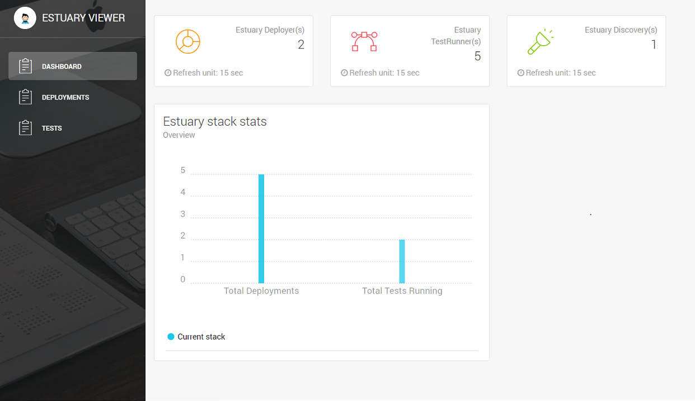

<h1 align="center"></h1>

Support project: <a href="https://paypal.me/catalindinuta?locale.x=en_US"></a>

## Estuary viewer
View live the estuary stack:
-   active deployments on the deployers
-   registered eureka apps
-   active commands running on the agents

## Docker Hub
[viewer](https://hub.docker.com/r/estuaryoss/viewer) 

## Build
[](https://travis-ci.org/estuaryoss/estuary-viewer)
[](https://www.codacy.com/gh/estuaryoss/estuary-viewer?utm_source=github.com&amp;utm_medium=referral&amp;utm_content=estuaryoss/estuary-viewer&amp;utm_campaign=Badge_Grade)

Frontend copyright(MIT license): https://github.com/creativetimofficial/vue-light-bootstrap-dashboard.git

<h1 align="center"></h1>

## Docker run - wo auth token
Default token is 'None' for no HTTP auth
```shell script
docker run -p 8080:8080 estuaryoss/viewer:latest \
bash -c "echo VUE_APP_ESTUARY_DISCOVERY=http(s)://estuary_discovery_ip:estuary_discovery_port > /home/node/app/.env; echo VUE_APP_HTTP_AUTH_TOKEN=None >> /home/node/app/.env;/home/node/app/start.sh"

```

E.g.:
```shell script
docker run -p 8080:8080 estuaryoss/viewer:latest bash -c "echo VUE_APP_ESTUARY_DISCOVERY=http://192.168.100.8:8080 > /home/node/app/.env; echo VUE_APP_HTTP_AUTH_TOKEN=None >> /home/node/app/.env; /home/node/app/start.sh"
```

## Docker run - with auth token
```shell script
docker run -p 8080:8080 estuaryoss/viewer:latest bash -c "echo VUE_APP_ESTUARY_DISCOVERY=http://192.168.100.8:8080 > /home/node/app/.env; echo VUE_APP_HTTP_AUTH_TOKEN=mysecrettoken >> /home/node/app/.env; /home/node/app/start.sh"
```

## Estuary stack
[Estuary deployer](https://github.com/estuaryoss/estuary-deployer)  
[Estuary agent](https://github.com/estuaryoss/estuary-agent)  
[Estuary discovery](https://github.com/estuaryoss/estuary-discovery)  
[Estuary viewer](https://github.com/estuaryoss/estuary-viewer)  
